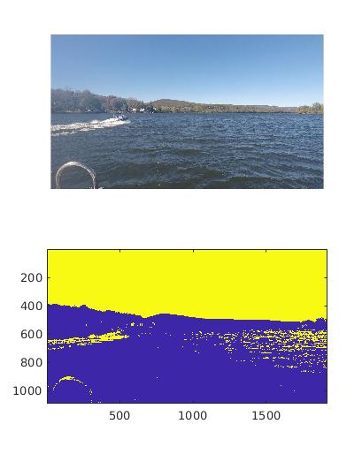
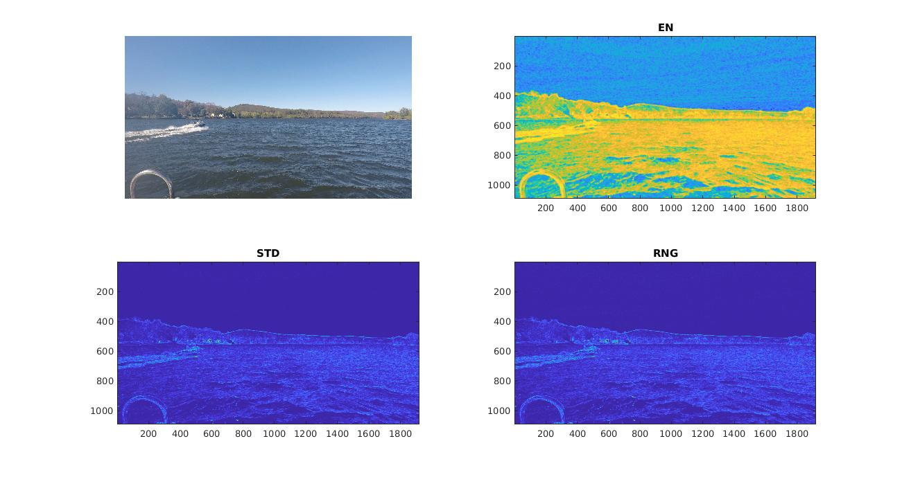
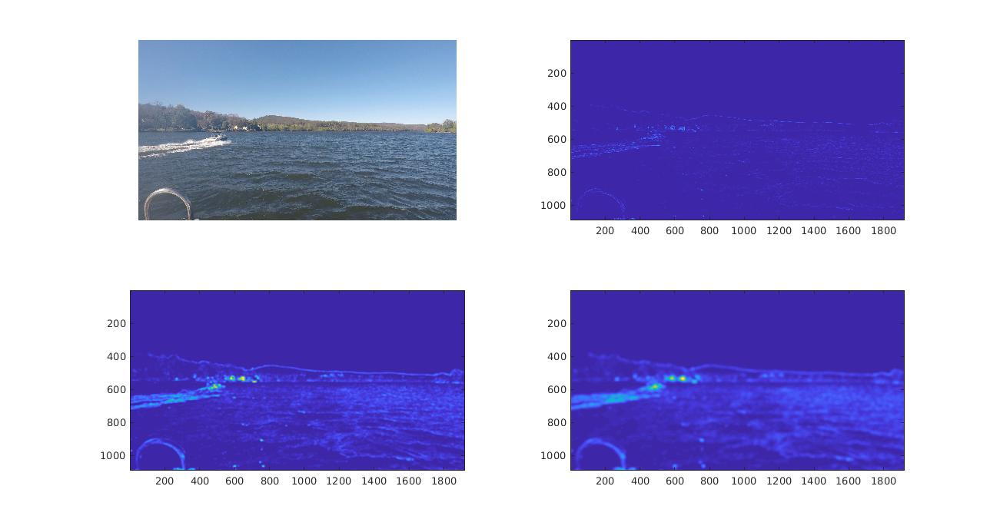
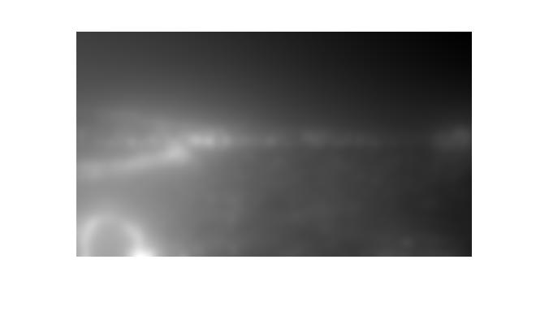
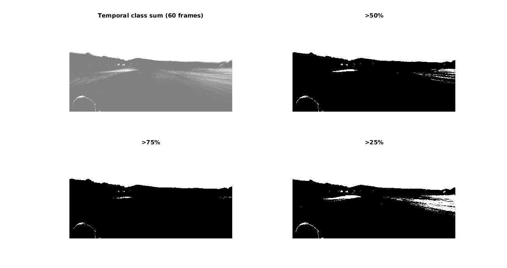
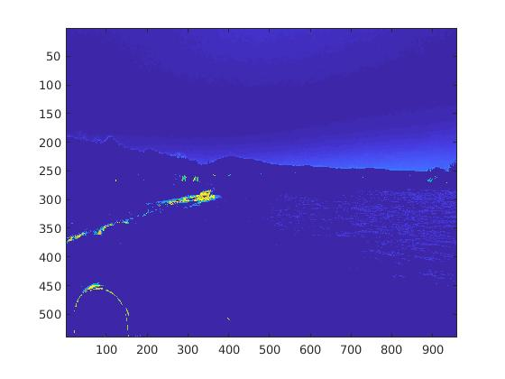
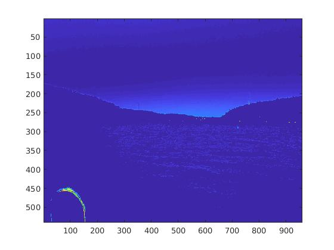

# HSV Segmentation
HSV segmentation does ok for a very controlled image, but of course has problems with wave caps.  Trained a 2 class k-means classifier, and it does a really good job of segmenting the land from the sky.  Also picks out some different objects in the water, and ocasionally wave tips.  Could temporally filter the state with a hysterisis trigger (like schmidt) based on class.

# Entropy Filtering
Sometimes objects have more local entropy than their immediate surroundings with a 9 pixel window.

# Entropy Filtering with Std Dev and Range filtering
Get better results by point-wise multiplying the resulting images of the Entropy Std Deviation, and Range filters with a gaussian blur to get rid of large localmaximums in the waves. Top right: no gaussian blur and image values scaled. Bottom left: gaussian blur sigma = 4 and image values scaled.  Bottom Right: gaussian blur sigma=8 and image values scaled.

# Texture filtering with Gabor filters
Compute gabor features and filter results on the image. (image bank of several frequencies, and orientations). Takes a long time to process the image though, and will not be good for real-time processing.  Could combine with filter bank concept and image scaling.  Use the post-processing techniques to get a decent segmentation result.
http://www.cse.iitm.ac.in/~vplab/courses/CV_DIP/PDF/Lect-Gabor_filt.pdf

# Temporal HSV filtering
Seems to work okay, but not that great.  Adding several past frames and thresholding on value seems to work for the frame I tested on, but speed needs to be improved in the HSV reclassification module. 30 frames and 60 frames were tested. Both seem reasonable.

# HSV Confidence filtering
Get pretty good results with kmeans HSV "not-water" classification when all "not water" classes are multiplied by the squared distance to the "not water" class.Squaring the distance metric seems to suppress water ripple effects better and highlight things that might be obstacles.

